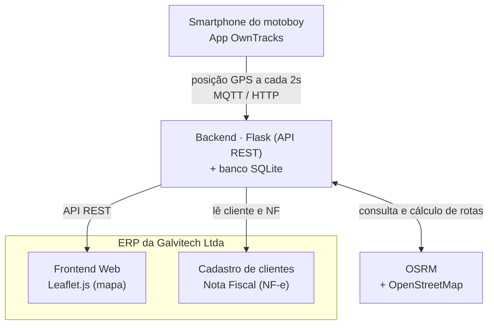

# Módulo de Rastreamento em Tempo Real de Motoboys

Módulo de rastreamento, roteirização e histórico de entregas **embarcado no ERP da Galvitech Ltda**, construído sobre tecnologias abertas e sem custos de licenciamento.

> **Trabalho de Conclusão de Curso — PAC ESOFT VII**
> Engenharia de Software · Centro Universitário Católica de Santa Catarina
> Autor: **André Gustavo Specht** · Orientador: **Prof. Andrei Carniel**

---

## Sumário

- [Contexto](#contexto)
- [Problema](#problema)
- [Proposta de solução](#proposta-de-solução)
- [Inovação e diferencial](#inovação-e-diferencial)
- [Necessidade de mercado](#necessidade-de-mercado)
- [Arquitetura](#arquitetura)
- [Funcionalidades (submódulos)](#funcionalidades-submódulos)
- [Tecnologias](#tecnologias)
- [Metodologia](#metodologia)
- [Resultados esperados](#resultados-esperados)
- [Cronograma](#cronograma)
- [Status do projeto](#status-do-projeto)
- [Pitch e documentação](#pitch-e-documentação)
- [Autor](#autor)

---

## Contexto

A **Galvitech Ltda** é uma empresa de Jaraguá do Sul/SC especializada na prestação de serviços de ERP para o setor de autopeças. Boa parte de seus clientes tem a operação fortemente apoiada em **entregas realizadas por motoboys**.

No entanto, o ERP **não dispõe de nenhum módulo voltado a essa atividade**: não há rastreamento em tempo real dos entregadores, não há cálculo de rotas otimizadas e as viagens não são registradas de forma estruturada. Na prática, o acompanhamento das entregas é feito de modo manual ou por aplicativos de terceiros desconectados do sistema de gestão.

## Problema

A ausência desse módulo gera consequências diretas para os clientes:

- Impossibilidade de informar **prazos confiáveis** ao cliente final;
- Dificuldade de **alocar o motoboy mais próximo** de cada entrega;
- **Ausência de histórico** estruturado para avaliação de desempenho;
- **Perda de rastreabilidade** entre as entregas e as respectivas notas fiscais.

Além disso, essa lacuna representa uma limitação competitiva frente a soluções especializadas que já oferecem visibilidade completa das operações.

> **Pergunta de pesquisa:** *em que medida um módulo de rastreamento em tempo real integrado ao ERP da Galvitech Ltda é capaz de suprir essa lacuna operacional e aumentar a eficiência na gestão de entregas por motoboys pelas empresas clientes?*

## Proposta de solução

Desenvolver um **módulo de rastreamento em tempo real de motoboys embarcado no próprio ERP**, construído sobre tecnologias abertas:

- **OwnTracks** para geolocalização (posição GPS via MQTT/HTTP);
- **OSRM (Open Source Routing Machine)** para cálculo e otimização de rotas sobre o OpenStreetMap;
- **Leaflet.js** para a visualização do mapa interativo;
- **backend em Flask + banco SQLite** para API, persistência e regras de negócio.

A solução **herda o cadastro de clientes e o vínculo com a nota fiscal já existentes no ERP**, registra histórico estruturado com *replay* de trilha e permite a exportação dos dados em Excel.

## Inovação e diferencial

O diferencial está em entregar um módulo **embarcado no próprio ERP**, baseado em tecnologias abertas e sem custos de licenciamento, que:

- herda automaticamente o **cadastro de clientes** e o **vínculo com a nota fiscal**;
- registra **histórico estruturado** de cada entrega;
- oferece **replay de trilha** para auditoria e avaliação;
- é validado por meio do questionário **SUS (System Usability Scale)** em ambiente real.

Essa combinação **não foi encontrada em nenhuma das soluções comparadas**. As plataformas comerciais resolvem partes do problema, mas obrigariam o cliente a operar em **dois sistemas distintos** — o ERP (onde residem a nota e o cliente) e a plataforma de entregas (onde fica a rota) —, fragmentando dados que precisam estar conectados. A **integração nativa elimina essa fragmentação**.

## Necessidade de mercado

As plataformas SaaS de terceiros disponíveis (como Vuupt, Loggi e Foody Delivery) confirmam a demanda do mercado, mas compartilham a mesma lacuna estrutural sob a ótica da Galvitech: são **serviços externos, cobrados mensalmente, hospedados em nuvem de terceiros, voltados a verticais específicos e não integrados nativamente ao ERP nem ao fluxo de nota fiscal do setor de autopeças**. Não existe, hoje, uma solução equivalente embarcada no ERP utilizado por esses clientes.

## Arquitetura

A arquitetura organiza-se em quatro componentes. O *app* OwnTracks no smartphone do motoboy publica a posição GPS a cada dois segundos (MQTT/HTTP); o backend em Flask recebe essas mensagens, expõe uma API REST, persiste os dados em SQLite e consulta o OSRM para o cálculo de rotas; o Leaflet.js renderiza o mapa interativo embutido no ERP; e o módulo lê diretamente o cadastro de clientes e a nota fiscal do próprio ERP.

## Funcionalidades (submódulos)

| # | Submódulo | Descrição |
|---|-----------|-----------|
| 1 | **Rastreamento GPS em tempo real** | Exibe a posição de múltiplos motoboys no mapa, com atualização a cada 2 segundos, a partir das mensagens do app OwnTracks. |
| 2 | **Gestão e otimização de rotas** | Calcula trajetos via OSRM sobre o OpenStreetMap, ordena as paradas pela heurística do vizinho mais próximo e oferece um modo *offline* de contingência. |
| 3 | **Cadastro de clientes** | Herdado diretamente do ERP, evitando redigitação. |
| 4 | **Histórico de viagens** | Registra cada entrega de forma estruturada e vinculada à respectiva nota fiscal, com exportação em Excel. |
| 5 | **Replay de trilha** | Reproduz o percurso realizado para auditoria e avaliação de desempenho. |

## Tecnologias

| Camada | Tecnologia | Função |
|--------|-----------|--------|
| Geolocalização | **OwnTracks** (MQTT/HTTP) | Publica a posição GPS do motoboy a cada 2 s |
| Backend | **Python + Flask** | API REST, regras de negócio e orquestração |
| Persistência | **SQLite** | Armazena viagens, posições e histórico |
| Roteirização | **OSRM + OpenStreetMap** | Cálculo e otimização de rotas |
| Visualização | **Leaflet.js** | Mapa interativo embarcado no ERP |
| Exportação | **Excel** | Saída de histórico e relatórios |

## Metodologia

O projeto adota a **Design Science Research (DSR)**, adequada à construção e avaliação de artefatos de software para problemas reais, organizada em quatro etapas:

1. **Levantamento de requisitos** funcionais e não funcionais (entrevistas com colaboradores e clientes);
2. **Projeto da arquitetura** e modelagem de dados;
3. **Implementação incremental** dos submódulos;
4. **Avaliação em ambiente real**, combinando a cronometragem do tempo de planejamento de rotas (antes e depois) e o questionário **SUS**.

## Resultados esperados

- Redução do **tempo médio de planejamento de rotas**;
- Disponibilização de **dados operacionais estruturados** (posição em tempo real, sequência otimizada de paradas e histórico de viagens);
- **Rastreabilidade ponta a ponta** das entregas, vinculada à nota fiscal;
- Escore de usabilidade na faixa **"boa" ou superior** no questionário SUS;
- Aumento do **valor competitivo do ERP** frente às plataformas SaaS de terceiros.

## Cronograma

Desenvolvimento previsto para **18 semanas** ao longo do PAC 8 (2026/2):

| Semanas | Atividade |
|---------|-----------|
| 1–2 | Levantamento e validação de requisitos |
| 2–4 | Projeto da arquitetura e modelagem de dados |
| 4–6 | Submódulo de rastreamento GPS (OwnTracks) |
| 6–9 | Submódulo de roteirização (OSRM + vizinho mais próximo + offline) |
| 9–11 | Cadastro de clientes e histórico vinculado à NF |
| 11–13 | Replay de trilha e exportação em Excel |
| 13–15 | Integração com o ERP e testes de integração |
| 14–16 | Avaliação em ambiente real (cronometragem + SUS) |
| 16–17 | Análise dos resultados e escrita do TCC |
| 17–18 | Revisão final e preparação da defesa |

> O levantamento inicial de requisitos tem início ainda ao final do PAC ESOFT VII (2026/1).

## Status do projeto

**Fase atual:** proposta e planejamento (PAC ESOFT VII — 2026/1).
**Próxima fase:** desenvolvimento e validação (PAC 8 — 2026/2).

## Pitch e documentação

- **Vídeo (pitch):** [assista no YouTube](https://www.youtube.com/watch?v=KaN6kuo9GSM)
- **Artigo completo (PDF):** [Portfólio PAC ESOFT VII](./docs/Portfolio-PAC-VII-Specht.pdf)

## Autor

**André Gustavo Specht**
Engenharia de Software — Centro Universitário Católica de Santa Catarina (Jaraguá do Sul/SC)
Proprietário da Galvitech Ltda

---

Projeto acadêmico desenvolvido para o PAC ESOFT VII. Orientação: Prof. Andrei Carniel.
