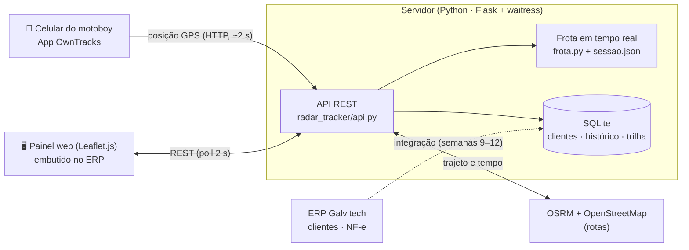

# Módulo de Rastreamento em Tempo Real de Motoboys

Módulo de rastreamento, roteirização e histórico de entregas **embarcado no ERP da Galvitech Ltda**, construído sobre tecnologias abertas e sem custos de licenciamento. O piloto roda na **Radar Auto Peças** (Jaraguá do Sul/SC).

[](https://github.com/AndreeSpecht/rastreamento-motoboys-galvitech/actions/workflows/testes.yml)


> **Trabalho de Conclusão de Curso · PAC ESOFT VII / PAC 8**
> Engenharia de Software · Centro Universitário Católica de Santa Catarina
> Autor: **André Gustavo Specht** · Orientador: **Prof. Andrei Carniel**

---

## Sumário

- [Início rápido](#início-rápido)
- [Funcionalidades](#funcionalidades)
- [Contexto e problema](#contexto-e-problema)
- [Proposta e diferencial](#proposta-e-diferencial)
- [Arquitetura](#arquitetura)
- [Tecnologias](#tecnologias)
- [Estrutura do repositório](#estrutura-do-repositório)
- [Configuração](#configuração)
- [Testes](#testes)
- [Metodologia e resultados esperados](#metodologia-e-resultados-esperados)
- [Cronograma de entregas](#cronograma-de-entregas)
- [Documentação](#documentação)
- [Autor](#autor)

---

## Início rápido

Pré-requisito: **Python 3.10+** ([download](https://www.python.org/downloads/); no Windows marque *Add python.exe to PATH*).

**Windows**

```bat
git clone https://github.com/AndreeSpecht/rastreamento-motoboys-galvitech.git
cd rastreamento-motoboys-galvitech
instalar.bat
iniciar.bat
```

**Linux / macOS**

```bash
git clone https://github.com/AndreeSpecht/rastreamento-motoboys-galvitech.git
cd rastreamento-motoboys-galvitech
./instalar.sh && ./iniciar.sh
```

O painel abre em **http://127.0.0.1:5000** com clientes de demonstração. Para ver um motoboy andando sem celular, monte uma rota no painel e execute:

```bash
python scripts/simular_motoboy.py --tid 0      # use .venv\Scripts\python no Windows
```

Instalação manual, túnel para os celulares (ngrok) e configuração do app OwnTracks estão em **[docs/instalacao.md](docs/instalacao.md)**.

## Funcionalidades

| # | Submódulo | O que faz | Status |
|---|-----------|-----------|--------|
| 1 | **Rastreamento GPS em tempo real** | Mostra todos os motoboys no mapa, com nome e velocidade, atualizando a cada 2 s a partir do app OwnTracks. Leituras imprecisas ou com saltos impossíveis são descartadas. | ✅ |
| 2 | **Gestão e otimização de rotas** | Monta a rota por cliente cadastrado, busca de endereço ou clique no mapa. Calcula trajeto e tempo pelo OSRM, otimiza pela heurística do vizinho mais próximo e tem modo offline. | ✅ |
| 3 | **Cadastro de clientes** | Cadastro georreferenciado com telefone e cor. Importação do ERP prevista para a semana 9. | ✅ / 🔜 |
| 4 | **Histórico de viagens** | Cada entrega exige o nº da nota e é registrada com motoboy, horários e destinos. Filtro por período e exportação Excel. | ✅ |
| 5 | **Replay de trilha** | Reproduz o percurso do motoboy em um dia, para auditoria e avaliação. | ✅ |

## Contexto e problema

A **Galvitech Ltda** é uma empresa de Jaraguá do Sul/SC especializada em ERP para o setor de autopeças. Boa parte de seus clientes depende de **entregas por motoboys**, mas o ERP **não tem nenhum módulo para essa atividade**. Não há rastreamento, cálculo de rotas nem registro estruturado das viagens. As consequências são:

- impossibilidade de informar **prazos confiáveis** ao cliente final;
- dificuldade de **alocar o motoboy mais próximo**;
- **ausência de histórico** para avaliação de desempenho;
- **perda de rastreabilidade** entre entregas e notas fiscais.

> **Pergunta de pesquisa:** *em que medida um módulo de rastreamento em tempo real integrado ao ERP da Galvitech Ltda é capaz de suprir essa lacuna operacional e aumentar a eficiência na gestão de entregas por motoboys pelas empresas clientes?*

## Proposta e diferencial

O módulo fica **embarcado no próprio ERP**, usa **apenas tecnologias abertas** e:

- herda o **cadastro de clientes** e o **vínculo com a nota fiscal**;
- registra **histórico estruturado** e oferece **replay de trilha**;
- funciona mesmo com o serviço de rotas fora do ar (**modo offline**);
- é validado em ambiente real com o questionário **SUS**.

Plataformas SaaS como Vuupt, Loggi e Foody Delivery confirmam a demanda, mas são serviços externos com mensalidade, voltados a outros setores e **não integrados ao ERP nem ao fluxo de nota fiscal de autopeças**. Com elas, o cliente teria que operar em dois sistemas diferentes. A integração nativa elimina essa fragmentação.

## Arquitetura


```mermaid
flowchart LR
    APP["📱 Celular do motoboy<br/>App OwnTracks"]
    subgraph SRV["Servidor (Python · Flask + waitress)"]
        API["API REST<br/>radar_tracker/api.py"]
        FROTA["Frota em tempo real<br/>frota.py + sessao.json"]
        DB[("SQLite<br/>clientes · histórico · trilha")]
    end
    OSRM["OSRM + OpenStreetMap<br/>(rotas)"]
    WEB["🖥️ Painel web (Leaflet.js)<br/>embutido no ERP"]
    ERP["ERP Galvitech<br/>clientes · NF-e"]

    APP -- "posição GPS (HTTP, ~2 s)" --> API
    WEB <-->|"REST (poll 2 s)"| API
    API --> FROTA
    API --> DB
    API <-->|"trajeto e tempo"| OSRM
    ERP -.->|"integração (semanas 9–12)"| DB
```

Detalhes, diagramas de estado e sequência e as decisões de projeto estão em [docs/arquitetura.md](docs/arquitetura.md).

## Tecnologias

| Camada | Tecnologia | Função |
|--------|-----------|--------|
| Geolocalização | **OwnTracks** (HTTP) | Envia a posição GPS do motoboy |
| Backend | **Python 3.10+ · Flask · waitress** | API REST, regras de negócio e servidor de produção |
| Persistência | **SQLite** | Clientes, histórico de viagens e trilhas GPS |
| Roteirização | **OSRM + OpenStreetMap** | Trajeto e tempo estimado (com fallback offline) |
| Geocodificação | **Nominatim** | Busca de endereços |
| Visualização | **Leaflet.js** | Mapa interativo |
| Relatórios | **openpyxl** | Exportação do histórico em Excel |
| Qualidade | **pytest · GitHub Actions** | 29 testes em Windows e Ubuntu |

## Estrutura do repositório

```
rastreamento-motoboys-galvitech/
├── radar_tracker/            # aplicação (pacote Python)
│   ├── __init__.py           # create_app()
│   ├── api.py                # endpoints REST + OwnTracks + Excel
│   ├── config.py             # configuração via .env
│   ├── db.py                 # SQLite: esquema, migrações, consultas
│   ├── frota.py              # estado dos motoboys + filtro de GPS
│   ├── geo.py                # haversine, velocidade, vizinho mais próximo
│   ├── roteamento.py         # OSRM + fallback offline + Nominatim
│   ├── templates/index.html  # painel
│   └── static/               # CSS e JavaScript do painel
├── config/motoboys.example.json
├── scripts/
│   ├── seed_demo.py          # clientes fictícios
│   ├── simular_motoboy.py    # simulador do OwnTracks
│   ├── windows/tunel_ngrok.bat
│   └── docs/                 # gerador do cronograma (.docx/.md)
├── tests/                    # suíte pytest
├── docs/                     # documentação e cronograma
├── instalar.bat · iniciar.bat · instalar.sh · iniciar.sh
├── run.py                    # ponto de entrada
├── requirements.txt · requirements-dev.txt · .env.example
└── .github/workflows/testes.yml
```

## Configuração

Todas as opções ficam no arquivo `.env`, criado pelo instalador a partir de [`.env.example`](.env.example): nome e coordenadas da loja, cidade de busca, servidor OSRM, fator de atraso, token do OwnTracks e limites do filtro de GPS. Os motoboys ficam em `config/motoboys.json` (nome, cor e Tracker ID do OwnTracks).

Banco, sessão, `.env` e `config/motoboys.json` **não são versionados**, para que dados reais de clientes nunca vão para o repositório público.

## Testes

```bash
pip install -r requirements-dev.txt
pytest
```

A suíte cobre as funções geográficas, o ciclo de entrega, o filtro de GPS, todos os endpoints, o OwnTracks (com e sem token) e a exportação Excel. A rede fica bloqueada durante os testes, o que também valida o modo offline. O CI roda a cada push em Windows e Ubuntu (Python 3.10, 3.12 e 3.13).

## Metodologia e resultados esperados

O projeto adota a **Design Science Research (DSR)** em quatro etapas: (1) levantamento de requisitos ([docs/requisitos.md](docs/requisitos.md)); (2) projeto da arquitetura e modelagem de dados; (3) implementação incremental com entregas semanais; (4) avaliação em ambiente real com cronometragem do planejamento de rotas (antes/depois) e questionário **SUS**.

Resultados esperados:

- redução do **tempo médio de planejamento de rotas**;
- **dados operacionais estruturados** (posição em tempo real, sequência otimizada de paradas, histórico de viagens);
- **rastreabilidade ponta a ponta** das entregas vinculada à nota fiscal;
- escore **SUS "bom" ou superior** (≥ 71);
- aumento do **valor competitivo do ERP** frente a plataformas SaaS.

## Cronograma de entregas

Entregas **toda sexta-feira** do PAC 8 (07/08 a 04/12/2026). Documento completo e editável: **[docs/Cronograma_Entregas_TCC.docx](docs/Cronograma_Entregas_TCC.docx)** · versão web: [docs/cronograma.md](docs/cronograma.md). As semanas futuras estão nos [milestones do GitHub](https://github.com/AndreeSpecht/rastreamento-motoboys-galvitech/milestones).

| Sem. | Sexta | Entrega | Status |
|:---:|:---:|---|:---:|
| 1–2 | 07/08 – 14/08 | Levantamento e validação de requisitos | ✅ |
| 3–4 | 21/08 – 28/08 | Arquitetura, modelo de dados e contrato da API | ✅ |
| 5–6 | 04/09 – 11/09 | Rastreamento GPS (OwnTracks), filtro de GPS e simulador | ✅ |
| 7 | 18/09 | Roteirização OSRM + vizinho mais próximo + offline | ✅ |
| 8 | 25/09 | Refatoração, testes, CI e documentação · **v0.8.0** | ✅ |
| 9 | 02/10 | Importação do cadastro de clientes do ERP | 🔜 |
| 10 | 09/10 | Vínculo da viagem com a NF-e do ERP | 🔜 |
| 11 | 16/10 | Indicadores de desempenho e replay aprimorado | 🔜 |
| 12 | 23/10 | Painel embarcado no ERP + login de operador | 🔜 |
| 13 | 30/10 | Testes de integração e homologação · **v0.9.0** | 🔜 |
| 14–16 | 06/11 – 20/11 | Avaliação real: cronometragem e SUS | 🔜 |
| 17 | 27/11 | Análise dos resultados e escrita do TCC | 🔜 |
| 18 | 04/12 | Revisão final e defesa · **v1.0.0** | 🔜 |

## Documentação

| Documento | Conteúdo |
|-----------|----------|
| [docs/instalacao.md](docs/instalacao.md) | Instalação, ngrok, OwnTracks, simulador, solução de problemas |
| [docs/requisitos.md](docs/requisitos.md) | Atores, requisitos funcionais e não funcionais, regras de negócio |
| [docs/arquitetura.md](docs/arquitetura.md) | Componentes, camadas, fluxos, algoritmo de rotas, decisões |
| [docs/api.md](docs/api.md) | Referência de todos os endpoints |
| [docs/banco-de-dados.md](docs/banco-de-dados.md) | Modelo ER, sessão da frota, backup |
| [docs/desenvolvimento.md](docs/desenvolvimento.md) | Histórico do desenvolvimento, do protótipo à versão atual |
| [docs/cronograma.md](docs/cronograma.md) | Cronograma detalhado de entregas |
| [CHANGELOG.md](CHANGELOG.md) | Mudanças por versão |
| [Portfólio PAC ESOFT VII (PDF)](docs/Portfolio-PAC-VII-Specht.pdf) | Artigo da proposta |
| [Pitch (YouTube)](https://www.youtube.com/watch?v=KaN6kuo9GSM) | Vídeo de apresentação |

## Autor

**André Gustavo Specht**
Engenharia de Software, Centro Universitário Católica de Santa Catarina (Jaraguá do Sul/SC)
Proprietário da Galvitech Ltda

---

<sub>Projeto acadêmico desenvolvido no PAC ESOFT VII e PAC 8. Orientação: Prof. Andrei Carniel.</sub>
