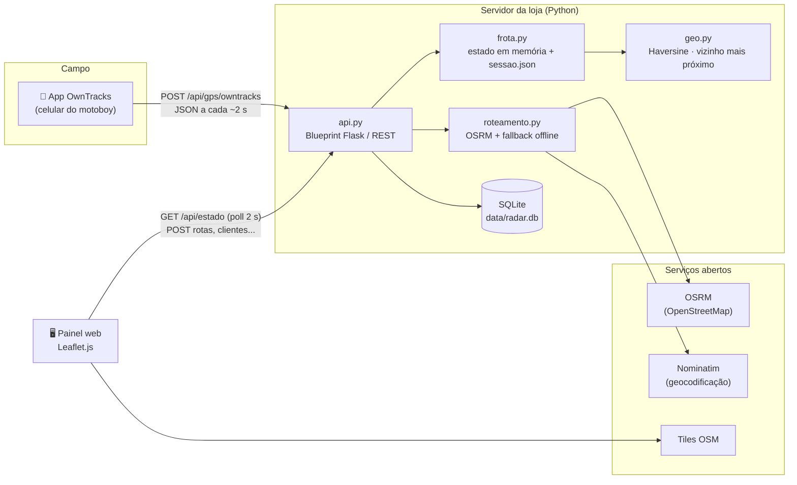
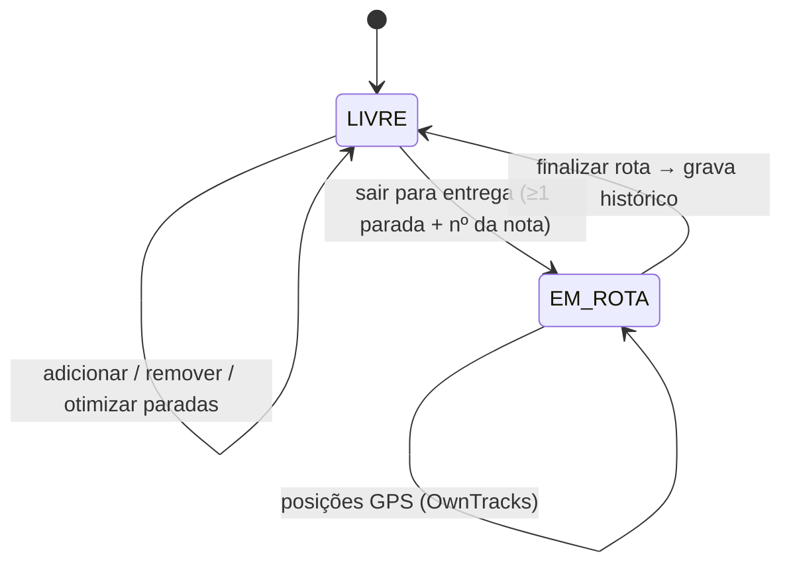
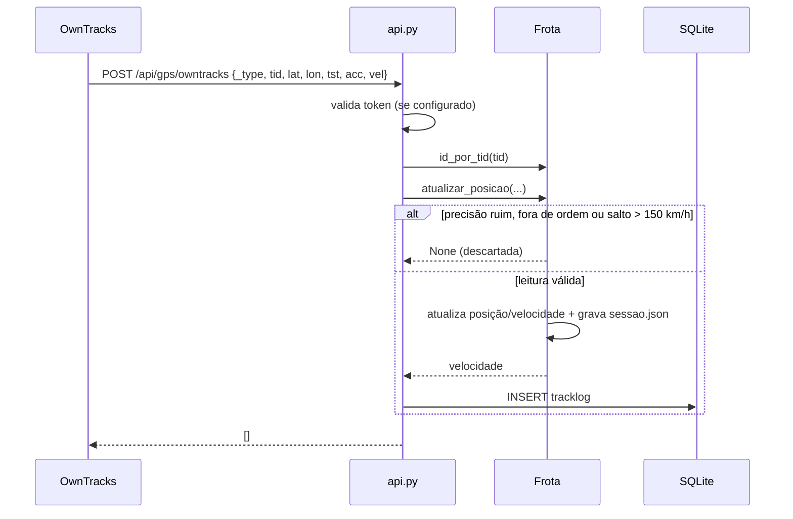

# Arquitetura

## Visão geral

O motoboy não precisa de um app próprio: o **OwnTracks** (gratuito, Android/iOS) é configurado em modo HTTP para enviar a posição ao servidor. Quando o servidor fica atrás de um roteador, o túnel **ngrok** (ou Cloudflare Tunnel) publica o endereço para os celulares.

## Camadas do código

| Arquivo | Responsabilidade | Depende de |
|---------|------------------|------------|
| `run.py` | Linha de comando; sobe o servidor `waitress` (produção) ou o servidor do Flask (`--debug`). | `radar_tracker` |
| `radar_tracker/__init__.py` | `create_app()`: cria o banco, carrega a frota e registra as rotas. | todos |
| `radar_tracker/config.py` | Configuração por variáveis de ambiente / `.env` e leitura de `config/motoboys.json`. | — |
| `radar_tracker/api.py` | Endpoints HTTP, validação de entrada, exportação Excel. | frota, db, roteamento |
| `radar_tracker/frota.py` | Máquina de estados de cada motoboy (`LIVRE` ⇄ `EM_ROTA`), paradas, filtro de GPS, persistência da sessão. | geo |
| `radar_tracker/alertas.py` | Regras dos alertas (sem sinal, parado, bateria baixa) em funções puras, aplicadas ao estado da frota. | geo |
| `radar_tracker/geo.py` | Funções puras: distância, velocidade, ordenação de paradas. | — |
| `radar_tracker/roteamento.py` | Chamada ao OSRM e ao Nominatim com *timeout* e *fallback*. | geo, requests |
| `radar_tracker/db.py` | Esquema SQLite, migrações leves e consultas parametrizadas. | sqlite3 |
| `radar_tracker/templates`, `static` | Painel web (HTML, CSS, JS com Leaflet). | — |

As funções de `geo.py` não têm dependências, o que permite testá-las isoladamente. A `Frota` não conhece HTTP nem SQL. Por isso uma eventual troca do SQLite por outro banco fica restrita a `db.py`.

## Ciclo de vida de uma entrega

## Fluxo de uma leitura de GPS

## Cálculo de rota

1. O painel envia as paradas para `POST /api/calc`.
2. O servidor monta o circuito `loja → paradas → loja` e consulta o OSRM (`/route/v1/driving`, *timeout* de 3 s).
3. Com resposta: o tempo é `duração × FATOR_ATRASO` e o traçado (polyline) é decodificado para o mapa.
4. Sem resposta (offline ou erro): a distância em linha reta é somada com Haversine, e o tempo sai de `VELOCIDADE_MEDIA_OFFLINE_KMH` mais `MINUTOS_POR_PARADA` por parada. O painel indica que o valor é uma **estimativa offline**.

### Otimização (vizinho mais próximo)

A partir da posição atual do motoboy (ou da loja), o algoritmo escolhe sempre a parada ainda não visitada mais próxima (Golden & Assad, 1988). A complexidade é O(n²), desprezível para as 2 a 15 paradas típicas de uma rota de motoboy, e o resultado sai na hora, sem depender de serviço externo.

## Decisões de projeto

| Decisão | Alternativas consideradas | Motivo |
|---------|---------------------------|--------|
| **OwnTracks** no celular | App nativo próprio; rastreador veicular | Gratuito, open source, sem desenvolvimento mobile no escopo do TCC. |
| **Polling de 2 s** no painel | WebSocket / SSE | Simples, funciona atrás de qualquer proxy/túnel e atende ao RNF03. Poucos operadores simultâneos. |
| **SQLite** | PostgreSQL | Zero instalação e arquivo único, adequado ao volume de uma loja. `db.py` isola a troca futura. |
| **Estado da frota em memória + JSON** | Tabela no banco | Leitura a cada 2 s sem I/O de banco; gravação atômica garante recuperação após reinício. |
| **OSRM público** com fallback | Google Maps API | Sem custo e sem chave. O fallback cobre indisponibilidade. `OSRM_URL` permite servidor próprio. |
| **waitress** como servidor | gunicorn | Funciona nativamente no Windows, que é o ambiente das lojas. |

## Limitações conhecidas

- O servidor OSRM público tem limite de uso justo. Em produção com muitas lojas, recomenda-se hospedar um OSRM próprio com o recorte de SC.
- O estado da frota fica em um único processo (sem suporte a múltiplas instâncias do servidor).
- O painel ainda não tem autenticação de operador (planejada para a semana 12). Não exponha o painel publicamente sem um túnel com controle de acesso.
