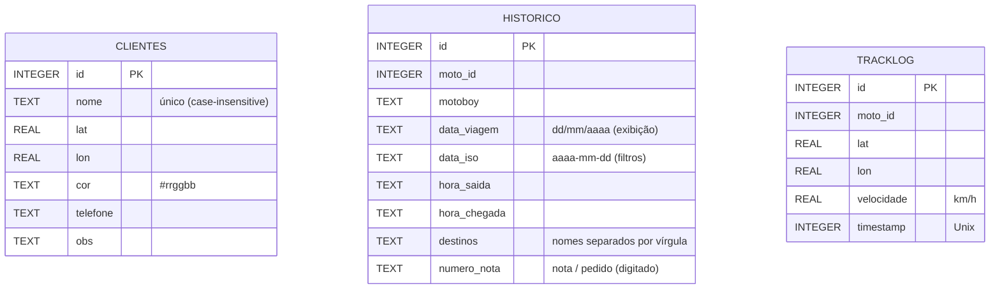

# Modelo de dados

Banco SQLite em `data/radar.db` (configurável por `DB_PATH`). O esquema é criado e migrado automaticamente na inicialização (`Banco.inicializar()`), e as colunas novas são adicionadas sem perder dados de versões anteriores, inclusive do protótipo V79.



Índice: `idx_tracklog_moto_ts (moto_id, timestamp)`, usado pelo replay de trilha.

## Estado da frota (`data/sessao.json`)

O estado "vivo" de cada motoboy fica em memória e é gravado de forma atômica (arquivo temporário + `os.replace`) a cada alteração:

```json
{
  "0": {
    "status": "EM_ROTA",
    "rota": [{ "nome": "Oficina Centro", "lat": -26.4851, "lon": -49.0713 }],
    "nota": "NF-1001",
    "hora_saida": "14:05",
    "lat_atual": -26.5012,
    "lon_atual": -49.0955,
    "velocidade": 38.5,
    "last_ts": 1790364807
  }
}
```

Nome e cor **não** ficam na sessão; vêm sempre de `config/motoboys.json`. Isso corrigiu o bug do protótipo em que finalizar uma rota apagava esses campos.

## Configuração dos motoboys (`config/motoboys.json`)

```json
[
  { "id": 0, "nome": "Motoboy Um", "cor": "#e74c3c", "tid": "0" }
]
```

`tid` é o *Tracker ID* configurado no app OwnTracks do motoboy (até 2 caracteres). O arquivo real fica fora do Git; o repositório traz apenas `motoboys.example.json`.

## Backup

Para backup, basta copiar a pasta `data/`. Para zerar o sistema, apague a pasta: ela é recriada vazia no próximo início, e `python scripts/seed_demo.py` repõe os clientes de demonstração.
